# Microsoft 365 Admin Centre Lab

## Project Overview

This repository documents a hands-on Microsoft 365 Admin Centre lab focused on entry-level IT Support and Service Desk tasks.

The purpose of this project is to practise common Microsoft 365 administration workflows, including user management, password resets, licence assignment, sign-in management, groups, mailbox basics, and support documentation.

This lab is designed to show practical understanding of how Microsoft 365 is used in workplace IT support environments.

## Lab Environment

| Component | Details |
|---|---|
| Platform | Microsoft 365 Admin Centre |
| Lab Type | IT Support / Microsoft 365 Administration |
| Focus Areas | User accounts, passwords, licences, groups, mailbox basics, support documentation |
| Documentation | GitHub README, lab notes, screenshots, sample tickets |

## Completed Labs

| Lab | Topic | Status |
|---|---|---|
| Lab 01 | Microsoft 365 Admin Centre Setup | Complete |
| Lab 02 | User Management | Complete |
| Lab 03 | Password Reset and Sign-in Management | Complete |
| Lab 04 | Groups and Access Management | Complete |
| Lab 05 | Mailbox and Shared Mailbox Basics | Complete |
| Lab 06 | Microsoft 365 Support Scenarios and Final Documentation | Not Started |

## Lab Notes

- [Lab 01 — Microsoft 365 Admin Centre Setup](notes/lab-01-microsoft-365-admin-centre-setup.md)
- [Lab 02 — User Management](notes/lab-02-user-management.md)
- [Lab 03 — Password Reset and Sign-in Management](notes/lab-03-password-reset-and-sign-in-management.md)
- [Lab 04 — Groups and Access Management](notes/lab-04-groups-and-access-management.md)
- [Lab 05 — Mailbox and Shared Mailbox Basics](notes/lab-05-mailbox-and-shared-mailbox-basics.md)

## Sample Tickets

Sample Microsoft 365 support tickets will be added during the project.

## Screenshots

### Lab 01 — Microsoft 365 Admin Centre Setup

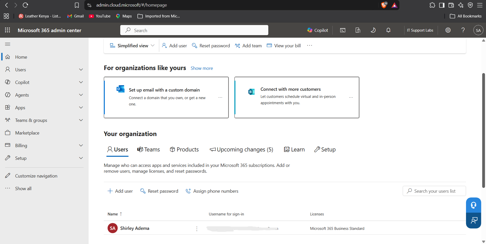

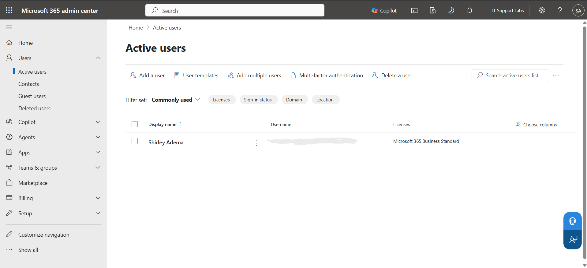

### Lab 02 — User Management

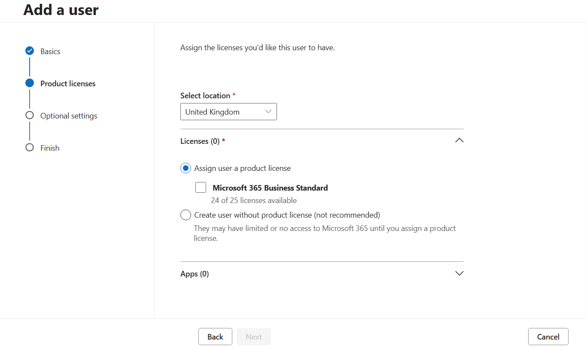

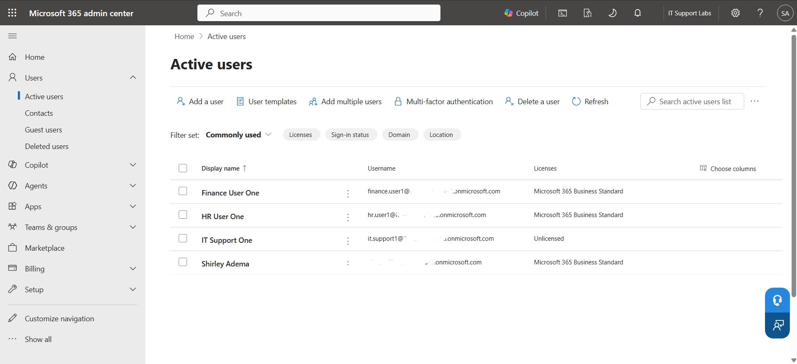

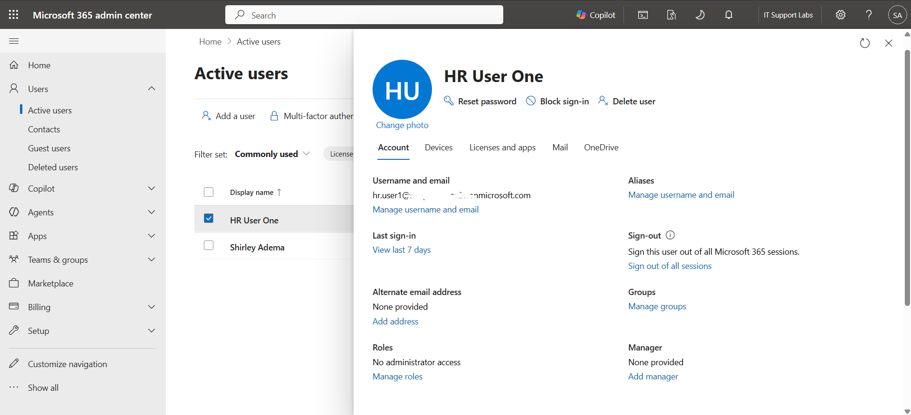

### Lab 03 — Password Reset and Sign-in Management

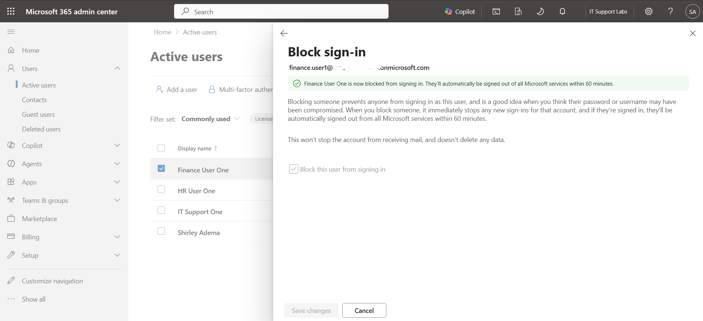

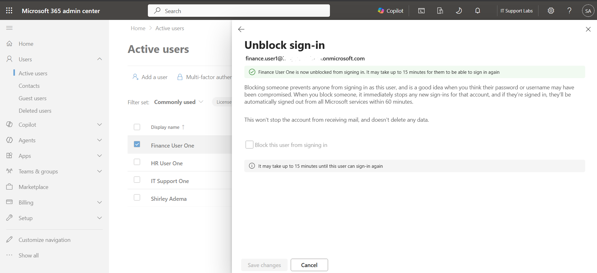

### Lab 04 — Groups and Access Management

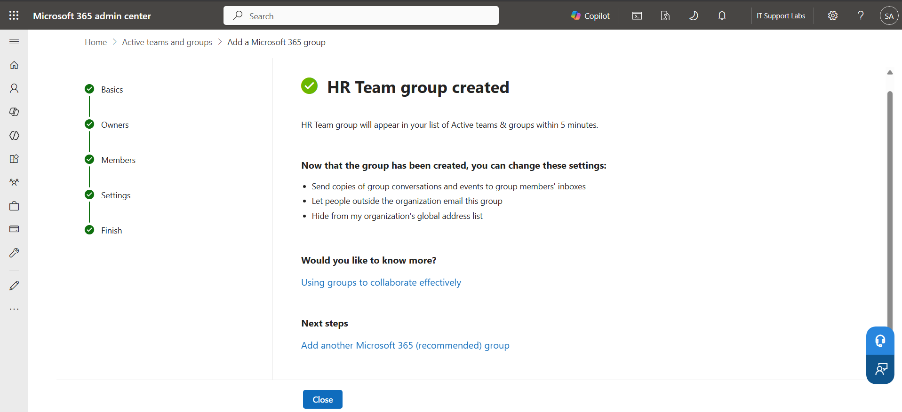

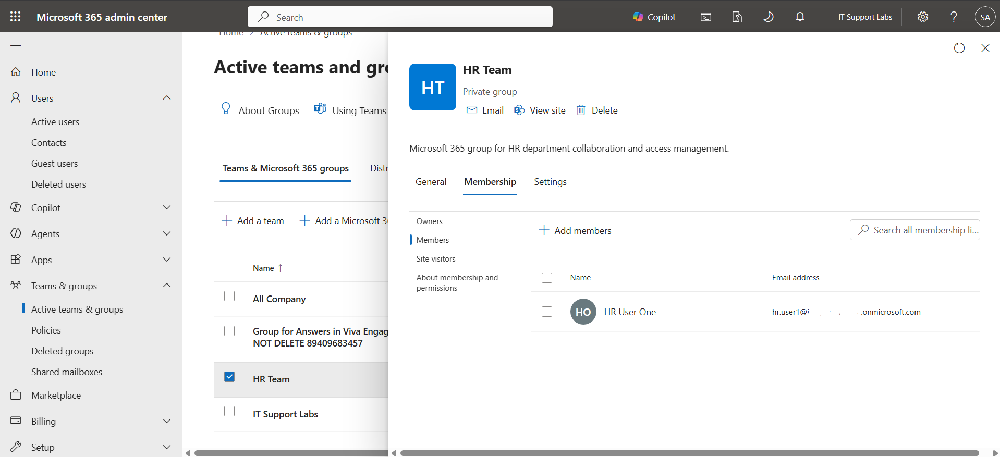

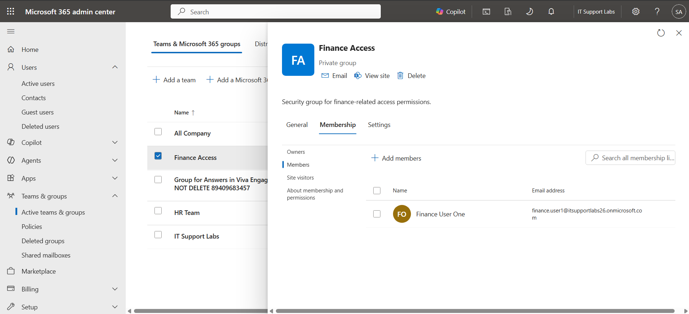

### Lab 05 — Mailbox and Shared Mailbox Basics

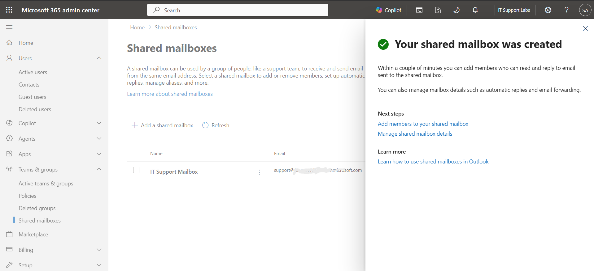

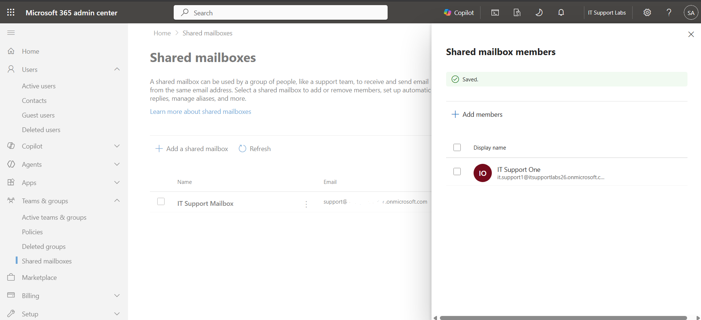

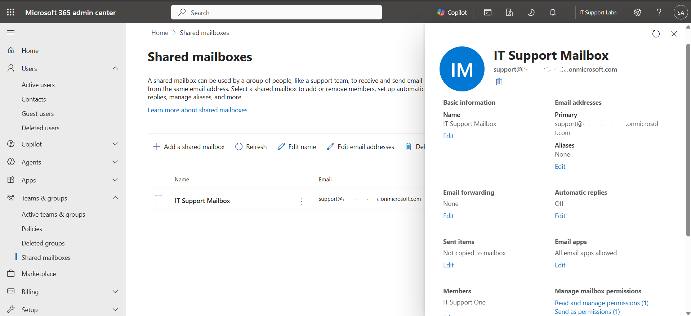

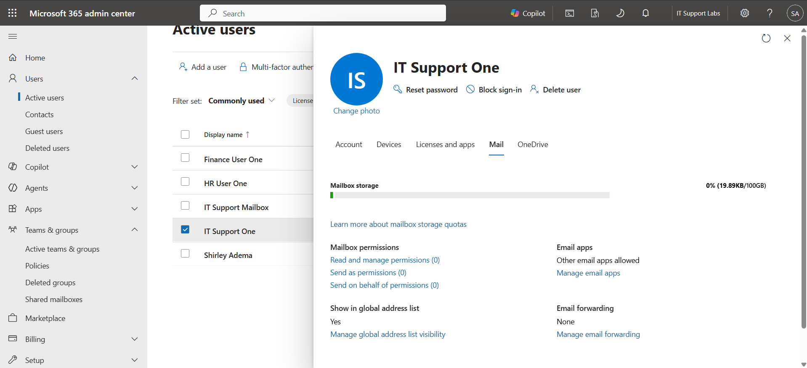

## Workflow Documentation

Workflow documentation will be added during the project.

## Skills Practised

- Microsoft 365 Admin Centre
- User account management
- Password resets
- Sign-in management
- Licence assignment
- Group management
- Mailbox administration basics
- Service desk documentation
- IT Support workflows
- Technical documentation

## What I Learned

This section will be updated as the lab progresses.
